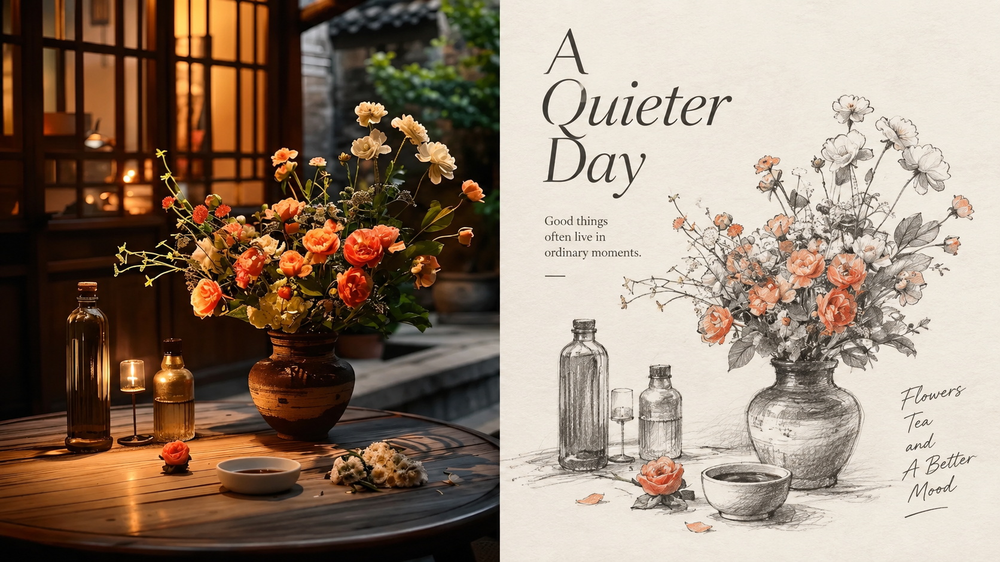
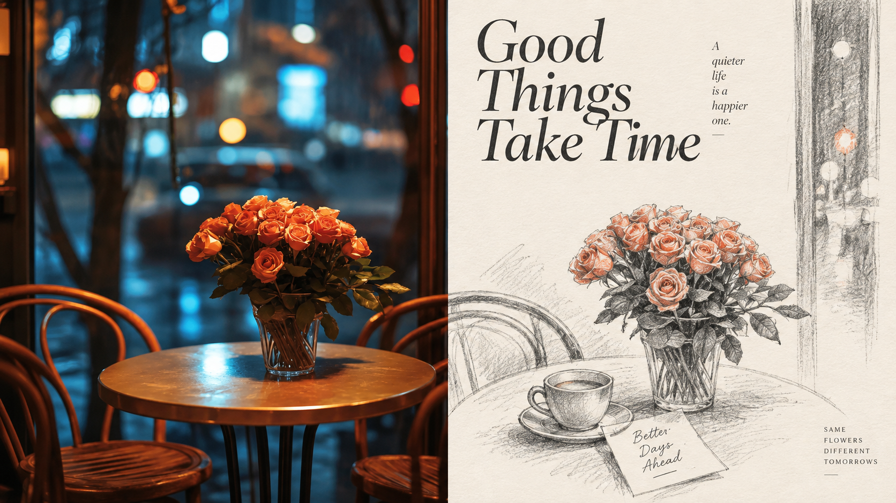
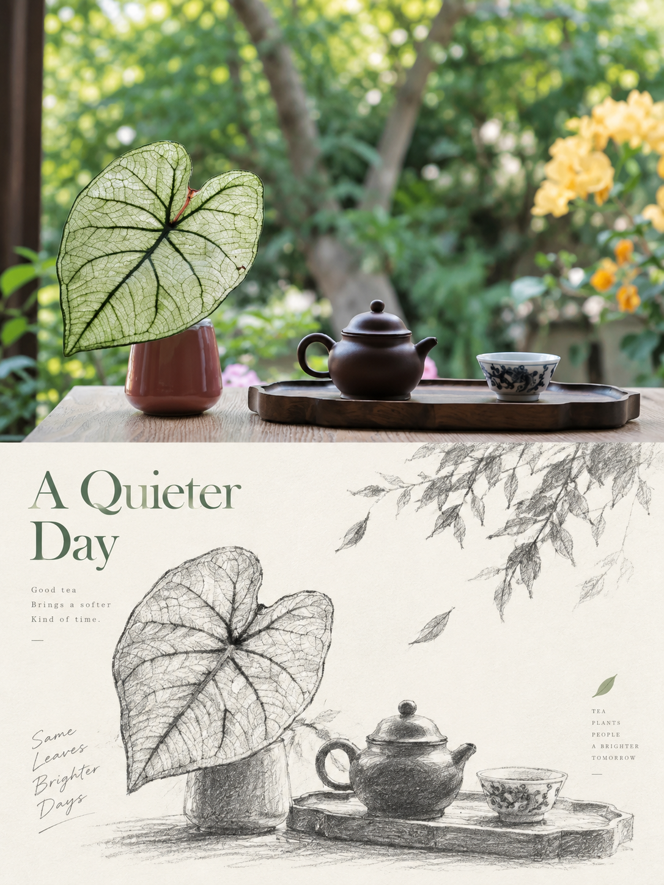
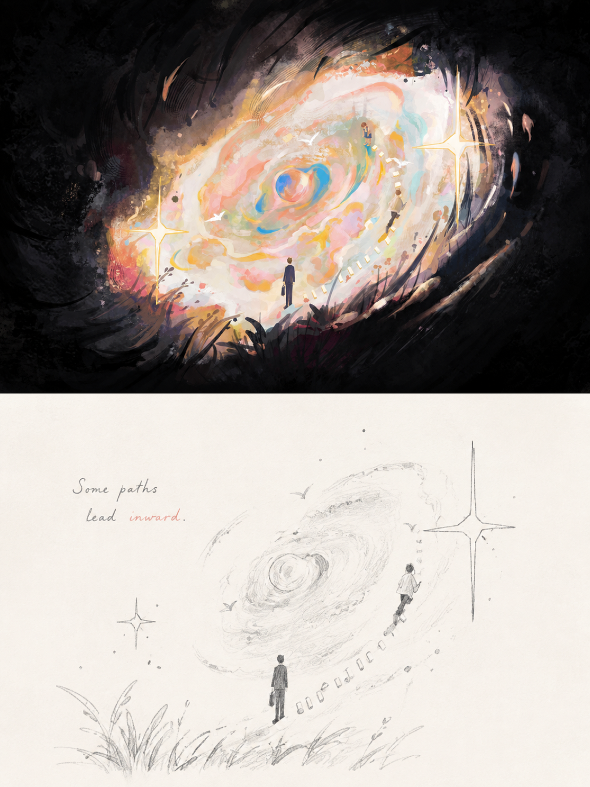
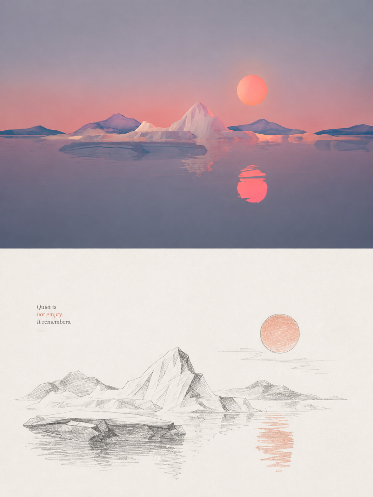

<div align="center">

# XXD Panel 118｜石墨留白素描志

从照片中留下值得记住的关系，用铅笔与留白重新构图。

<strong>简体中文</strong> · <a href="README.en.md">English</a> · <a href="README.ja.md">日本語</a> · <a href="README.ko.md">한국어</a> · <a href="README.ar.md">العربية</a>

</div>

## 样张展示

本项目已发布 8 张实际样片，图片文件位于 `assets/examples/`。

| sample-05 | sample-07 | sample-09 | sample-11 |
| --- | --- | --- | --- |
|  |  |
| sample-07 | sample-08 |
|  |  |
| sample-09 | sample-10 |
|  |  |
| sample-11 | sample-12 |
|  |  |

## 适用场景与解决的问题

照片里的主体很小、背景杂乱，或者你希望一张普通照片拥有独立出版物的表达时，**Panel 118** 会保留真实照片，并把设计区重新导演成石墨铅笔主题组合插画。它先判断什么值得留下，再重组尺度、位置与留白。

### 适合这些情况

- 保留照片身份与质感，同时制作有独立美术判断的编辑海报。
- 希望主题关系一眼可辨，但不想逐物描摹或复制原构图。
- 喜欢黑白石墨、自然排线和大量留白，而非复杂学院派写实。
- 需要上下、左右、纯设计、壁纸或目录批量交付。

### 它替你解决什么

- 主动修正主体过小、背景杂乱和普通构图。
- 通过删减、重组、裁切和尺度调整建立主题组合。
- 用正负形、疏密和非对称平衡让留白参与构图。
- 每张原图独立单轮生成，比较模式严格两区 50:50。

## 原始提示词 · 五种语言

[简体中文](references/original-prompt/zh-CN.md) · [English](references/original-prompt/en.md) · [日本語](references/original-prompt/ja.md) · [한국어](references/original-prompt/ko.md) · [العربية](references/original-prompt/ar.md)

中文原文逐字保存，是运行时唯一创作与审美权威；其他四语是完整阅读译文，不反向改写生成指令。

**关键词：** 石墨铅笔 · 自然排线 · 少量交叉排线 · 轻微灰调 · 主题组合 · 主动删减 · 大量留白 · 可选 1–2 种原图识别色

## 快速判断：Panel 118 适合你吗？

| 你关心的问题 | 这套风格给你的回答 |
|---|---|
| 原图构图普通怎么办？ | 设计区重新导演，不依赖原图布局。 |
| 还能看出对应关系吗？ | 保留最有意义的主题、结构走势和关系。 |
| 是传统写实素描吗？ | 造型松动、略稚拙，偏插画式速写。 |
| 能支持多尺寸吗？ | 四模式、常用与自定义比例、准确像素、目录批量。 |

## 它如何把照片变成成品

理解主题与结构关系 → 主动删减 → 重组与裁切 → 石墨轮廓、自然排线与轻灰 → 用留白和少量文字完成编辑构图。

## 成品中最容易识别的特点

- 黑白或自然石墨灰度主导，仅可极少量使用 1–2 种原图识别色。
- 轮廓松动、略稚拙，自然排线辅以少量交叉排线。
- 主体可偏心、贴边、悬置、放大、缩小或局部裁切。
- 留白与主体同等重要，宁可删掉信息也不填满。
- 少量词语或短句来自主题、地点、情绪或隐喻，没有固定语言、字体或格式。
- 避免照片复刻、复杂背景、过密细节、机械排版和模板感。

## 四种输出模式

- `top-bottom`：整张画布只有上下两个全宽区域，现实照片在上、设计在下，严格各占 50%。
- `left-right`：整张画布只有左右两个全高区域，现实照片在左、设计在右，严格各占 50%，不会旋转成上下结构。
- `design-only`：整张画布只呈现 Panel 118 的设计转译，照片只作为不可见参考。
- `wallpaper-pack`：按手机、iPad、桌面和手表分别生成完整设计壁纸，可选 `linked` 连贯套装或 `independent` 四张独立。

支持多选模式与比例（`1:1`、`3:4`、`4:3`、`4:5`、`5:4`、`2:3`、`3:2`、`9:16`、`16:9`、`21:9`、`5:7`、`7:5` 或准确像素），以及模型生成文字、准确文字和无文字。传入目录会递归扫描图片，每张源图独立处理，共用一次交付设置；最终 PNG 平铺放入一个新任务目录。

## 开始使用

```bash
git clone https://github.com/nevertoday/xxd-panel-118.git
npx skills add https://github.com/nevertoday/xxd-panel-118 --skill xxd-panel-118
```

安装后重新启动 Agent 会话，然后调用 `$xxd-panel-118`。也可以按需追加 `--global --agent codex --yes` 做用户级安装。

常用调用示例：

```text
/xxd-panel-118 photo.jpg --mode top-bottom --size 3:4 --text prompt --locale zh-CN
/xxd-panel-118 photo.jpg --mode left-right --size 16:9 --text prompt --locale en-US
/xxd-panel-118 photo.jpg --mode design-only --size 9:16 --text none
/xxd-panel-118 ./photos --mode design-only --size auto,3:4 --text prompt --locale ja-JP
```

完整运行契约见 [SKILL.md](SKILL.md)；运行适配器见 [英文](references/xxd-panel-118-prompt.en.md) 与 [中文](references/xxd-panel-118-prompt.zh-CN.md)。

<!-- xxd-readme-ads:start -->
## 关于 XXD

XXD 是小小东品牌名的缩写，本项目由小小东创建并维护： [@xiaoxiaodong01](https://x.com/xiaoxiaodong01).

## 广告信息｜XXD 付费服务与会员

> **广告与商业信息声明：** 以下二维码、会员与付费服务链接属于小小东的广告信息。是否扫码或购买完全自愿，不影响本开源项目的访问与使用。


<!-- xxd-panel-command-system:start -->

将军 Skills 已包含在 699 元/年的统一会员权益中，无需单独购买。

| 层级 | Skill | 负责什么 |
|---|---|---|
| **将军级** | [`xxd-panel-all`](https://github.com/xiaoxiaodong-ai/xxd-panel-all) | 识别当前可用的编号 Skills；按图片、主题和用途推荐；按编号点将；组织同图多风格试稿；为图片文件夹批量分配并逐项派发。 |
| **士兵级** | `xxd-panel-NNN` | 每个编号只执行自己独立的原始提示词与审美，把将军派发的单个任务完成为成品。 |

<!-- xxd-panel-command-system:end -->

### 知识星球＋成员提示词库＋Skills 所有将军会员 · 699 元/年

[知识星球](https://wx.zsxq.com/group/15554814142882)、[小小东成员提示词库](https://vip.xiaoxiaodong.ai/)与 Skills 所有将军会员是同一份会员权益：**一次年费同时开通三项权益，无需重复付费。**

[Knowledge Planet](https://wx.zsxq.com/group/15554814142882) · [Member Prompt Library](https://vip.xiaoxiaodong.ai/)

<p align="center"><a href="https://xiaoxiaodong.pages.dev/assets/wechat-qr.png"></a></p>
<!-- xxd-readme-ads:end -->

## 许可证

本项目（包括 Skill、提示词、脚本、文档及随附样张）采用 **PolyForm Noncommercial License 1.0.0**。完整法律条文请见 [LICENSE](LICENSE)，官方页面见 <https://polyformproject.org/licenses/noncommercial/1.0.0>。

用人话说：

- 个人可以用于学习、研究、实验、测试、兴趣项目和私人娱乐；慈善机构、教育机构、公共研究/安全/卫生机构、环保组织及政府机构也可以使用。
- 在**非商业目的**下，你可以使用、复制、修改、制作衍生作品并分享；分享时必须同时提供本许可证（或上面的链接）以及作者提供的所有 `Required Notice:` 声明。
- 不允许用于商业产品或服务、收费交付、出售访问权或许可，或任何预期会带来商业应用的用途。需要商业使用时，请先向版权方另行取得书面许可。
- 本协议只授予其中明确写出的著作权许可和有限的专利许可，不授予商标、品牌名称或其他未明确授予的权利，也不能把你的许可再转授给他人。
- 如果收到书面违约通知，须在 32 天内纠正并采取实际补救措施，否则许可会立即终止；就专利侵权提出书面主张也会终止专利许可。
- 内容按“现状”提供，在法律允许的范围内不作任何担保，使用风险和可能的损失由使用者自行承担。
